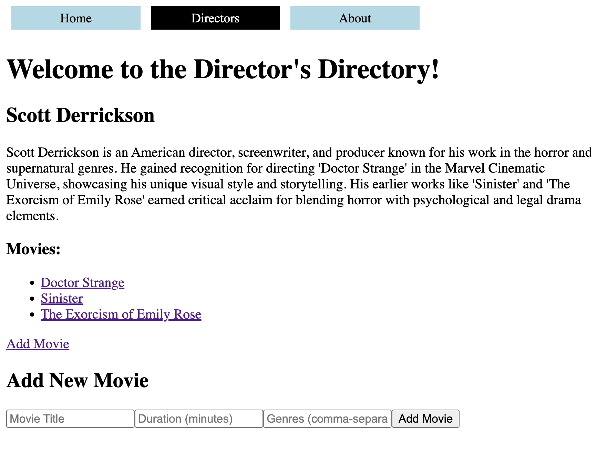

# Movie Directory App

A single-page movie directory app built with react and react-router v6. It lets users browse a list of directors and their movies, add new directors, and add/view detailed info about individual movies without refreshing the page. 
---

## Table of Contents

- [Demo](#demo)
- [Setup](#️setup)
- [Testing](#testing)
- [Features](#features)

---

## Demo

---

## Setup

1. Fork and clone the repo.
2. Install dependencies: `npm install`
3. Install react-router-dom v6: `npm install react-router-dom@6`
4. Start the json server: `npm run server`
5. Run `npm run dev` to start the dev server and follow link in browser

## Testing

- To run the tests: `npm run test`

## Features

- view a list of directors and their bios
- view each director’s movie collection
- add a new director and get redirected to their page
- add a new movie and get redirected to the movie’s detail page
- nested routes using <Outlet />
- shared state using useOutletContext()
- dynamic routing with :id and :movieId
- programmatic navigation with useNavigate()
- error handling for invalid urls (like non-existent director/movie)